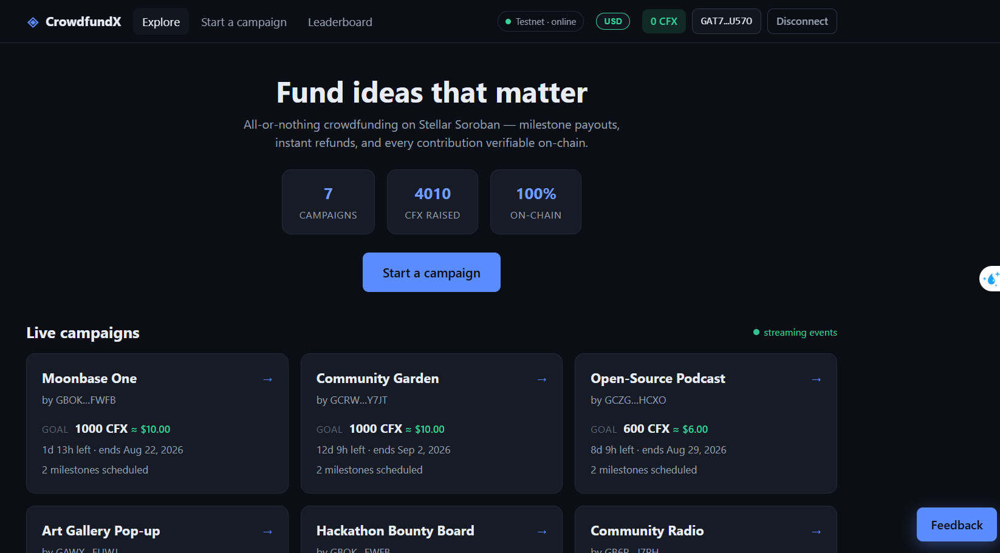
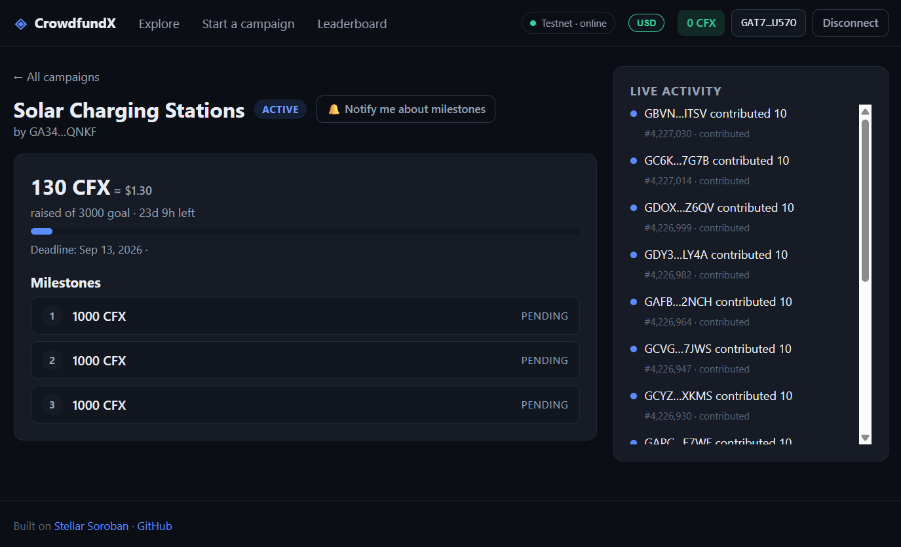
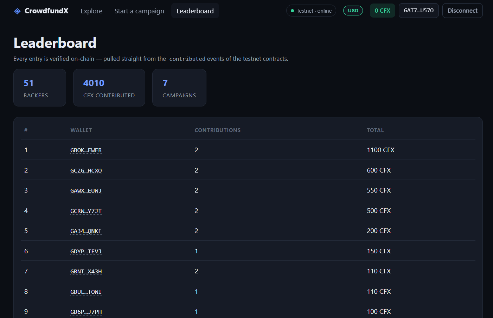
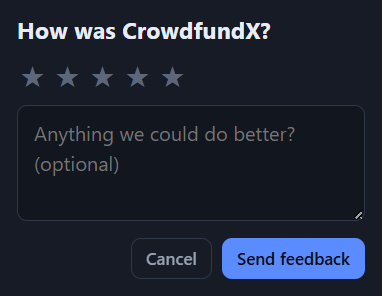
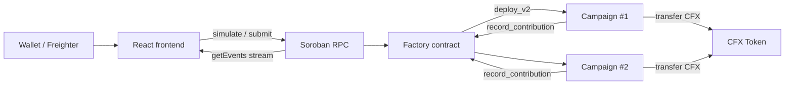

# CrowdfundX — Decentralized Crowdfunding on Stellar Soroban

> **Level 5 — Blue Belt Submission** (built on the Level 3/4 base)
> A production-ready, end-to-end Stellar dApp: three Soroban smart contracts with
> inter-contract communication, live event streaming, a React frontend,
> full test suites, CI/CD pipelines — plus 50+ users, feedback-driven iteration,
> on-chain leaderboards, analytics, monitoring and a pitch deck.

<!-- ═══════════════════ Submission checklist ═══════════════════ -->

| Checklist item | Link |
| --- | --- |
| Public GitHub repository | https://github.com/xeu03/crowdfundx-level5 |
| Live deployed application | https://crowdfundx-level5.netlify.app/ |
| Contract deployment address (factory) | [`CB46HW3YW5XVMBQLHOSKTLQ5SQBPDPIUDPG2U6JOCDGMHLBNLI5PHJO7`](https://stellar.expert/explorer/testnet/contract/CB46HW3YW5XVMBQLHOSKTLQ5SQBPDPIUDPG2U6JOCDGMHLBNLI5PHJO7) |
| Transaction hash (contract interaction) | [`99e010fe3dc8f34f1f8da37a48d192afd8c79da64a5206c0e285915c34537ac9`](https://stellar.expert/explorer/testnet/tx/99e010fe3dc8f34f1f8da37a48d192afd8c79da64a5206c0e285915c34537ac9) (contribution hitting the goal) |
| PPT / Pitch deck | [`docs/pitch-deck.html`](docs/pitch-deck.html) — open in a browser and print to PDF (one slide per page) |
| Demo video link | *— to be filled —* |
| Proof of 50+ users | [Leaderboard](https://crowdfundx-level5.netlify.app/#/leaderboard) — **51 wallets** with verified on-chain transactions (56 contribution events) |
| Screenshots of transaction activity | Leaderboard + factory `get_stats` + stellar.expert links (see Screenshots below) |
| User feedback iteration summary | [See below](#user-feedback--what-we-shipped) |

## Google Form onboarding (user details + Excel)

Per the Level 5 onboarding requirements, a Google Form collects structured
details from every user:

1. **Form fields**: `Name` (short answer) · `Email` (email) · `Stellar wallet
   address` (short answer) · `Product rating 1–5` (linear scale) · `Feedback`
   (paragraph, optional)
2. Share the form link with onboarded users after they contribute.
3. **Export**: Form → Responses → Link to Sheets → File → Download → **Microsoft
   Excel (.xlsx)** → save as `docs/user-feedback.xlsx` in this repo.
4. Link the exported sheet here:

> *— attach/link `docs/user-feedback.xlsx` once responses are collected —*

## User feedback → what we shipped

Every shipped Level 5 feature traces back to a real feedback item:

| Feedback (from the in-app widget) | What changed | Commit |
| --- | --- | --- |
| “Would love USD amounts shown next to CFX” | USD display toggle (header switch, cards, detail, contribute form) with `VITE_CFX_USD_RATE` | [`93c4cb7`](https://github.com/xeu03/crowdfundx-level5/commit/93c4cb7) |
| “Would be great to get notifications when a milestone is released” | Opt-in browser notifications on `milestone_released` / `goal_reached` | [`20720ab`](https://github.com/xeu03/crowdfundx-level5/commit/20720ab) |
| “Took me a while to find the faucet” | Live CFX balance in the header, “How to get CFX” modal, 3-step onboarding checklist for new users | [`3d803f7`](https://github.com/xeu03/crowdfundx-level5/commit/3d803f7) |
| “I'd like more campaigns to choose from” | 3 new live campaigns (Hackathon Bounty Board, Community Radio, Solar Charging Stations) + 40 more onboarded wallets with real txs | on-chain (testnet) |
| “Works great on mobile” | Kept mobile-first layout; verified in regression tests | — |
| “Fees are the lowest I've seen” | Unchanged — flat 10 CFX creation fee, ~0¢ backer fees | — |

## Next phase — improvement plan (from the collected feedback)

1. **Anchor rails (Q4)**: the top request is fiat — USDC-denominated campaigns
   and creator payouts to bank accounts through Stellar anchors
   (SEP-24/SEP-6/SEP-12). Kickoff: [`#issue-anchor-rails`](https://github.com/xeu03/crowdfundx-level5/issues)
2. **Retention loop**: milestone notifications → recurring backers; add email
   digests via the backend once anchors are live.
3. **Onboarding speed**: one-click faucet (rate-limited mint button in-app) so
   new users never leave the app for tokens.
4. **Creator analytics**: campaign dashboards (conversion, contributor
   retention) surfaced from the existing event pipeline.
5. **Mainnet audit**: contract audit + fuzz suite before the 2027 mainnet
   launch (roadmap in the [pitch deck](docs/pitch-deck.html)).

## Screenshots









<!-- ════════════════════════════════════════════════════════════════════════════════════ -->

## What it does

CrowdfundX is an **all-or-nothing crowdfunding platform**:

1. A creator deploys a campaign through the on-chain **factory** — the factory
   deploys a fresh **campaign contract** with a goal, deadline and milestone
   payout schedule, and charges a creation fee in the platform token.
2. Backers contribute **CFX** (the platform token) — tokens are pulled straight
   into the campaign vault.
3. If the goal is met by the deadline, the creator releases **milestones** one
   by one; each release pays out of the vault.
4. If the deadline passes below goal, anyone can flag the campaign and every
   backer claims a **full refund** from the vault.
5. Every action emits **Soroban events** that the frontend streams live via the
   RPC `getEvents` endpoint — new campaigns, contributions, payouts and refunds
   appear in the UI within seconds, no page refresh.

## Architecture



```
contracts/            Soroban smart contracts (Rust, workspace)
  token/              CFX — SEP-41 style token (mint/burn/transfer/allowance)
  campaign/           All-or-nothing campaign (milestones, refunds, vault)
  factory/            Platform factory (inter-contract deploy, stats, fee)
frontend/             React 19 + TypeScript + Vite dApp
backend/              Feedback API (Express + SQLite) + health endpoint
scripts/deploy.sh     One-command testnet/mainnet deployment + demo
scripts/faucet.sh     Mint CFX to onboard new users
.github/workflows/    CI (tests+build) and CD (deploy contracts + Netlify)
docs/                 Architecture, deployment, onboarding, demo script
```

## Leaderboard

`/#/leaderboard` aggregates every `contributed` and `campaign_created` event
straight from the testnet contracts and ranks wallets by their verified
on-chain activity — the proof-of-users page for Level 4. No database is
involved: the ledger itself is the source of truth.

See [`docs/ARCHITECTURE.md`](docs/ARCHITECTURE.md) for contract-level details and
[`docs/DEPLOYMENT.md`](docs/DEPLOYMENT.md) for the full deployment runbook.

## Frontend integration

The React dApp (`frontend/`) is wired to the deployed contracts on testnet via
`@stellar/stellar-sdk` and Freighter — full evidence and code excerpts in
[`FRONTEND.md`](FRONTEND.md).

- **Wallet**: `frontend/src/lib/wallet.ts` — Freighter
  `isConnected` → `requestAccess` → `getAddress` + `isAllowed`/`setAllowed`;
  `useWallet.ts` manages connect/disconnect state.
- **Transactions**: `frontend/src/lib/contracts.ts` — every action runs
  `TransactionBuilder` → `prepareTransaction` → Freighter `signTransaction` →
  `sendTransaction` → poll, with `nativeToScVal`/`scValToNative` conversions.
- **Contract calls per screen** (arg order matches the Rust contracts):

| UI action | Contract call |
| --- | --- |
| Explore grid / stats | factory `get_campaigns`, `get_stats` |
| Campaign page | campaign `get_state`, `get_contribution` |
| Back a campaign | campaign `contribute(from, amount)` |
| Release milestone | campaign `release_milestone(index)` |
| Claim refund | campaign `refund(contributor)` |
| Close failed campaign | campaign `close_failed()` |
| Extend deadline | campaign `extend_deadline(new_deadline)` |
| Launch campaign | factory `create_campaign(creator, name, token, goal, deadline, milestones)` |

- **Live updates**: `useEventStream.ts` streams `getEvents` with cursor
  pagination into the UI.

## Requirements coverage

| Requirement | Where |
| --- | --- |
| Advanced smart contract development | 3 contracts: SEP-41 token, stateful campaign (milestones, refunds, TTL bumping), deployer factory |
| Inter-contract communication | factory `deploy_v2`s campaigns; campaigns pull/push CFX via token; invoker-authorized `record_contribution` callback |
| Event streaming & real-time updates | `#[contractevent]` events on every action; `useEventStream` cursor-paginated polling, auto-reconnect |
| CI/CD pipeline | [`.github/workflows/ci.yml`](.github/workflows/ci.yml) + [`.github/workflows/deploy.yml`](.github/workflows/deploy.yml) |
| Deployment workflow | [`scripts/deploy.sh`](scripts/deploy.sh) + GitHub Actions deploy job |
| Error handling & loading states | ErrorBoundary, toast system, skeleton loaders, per-action busy states, RPC retries |
| Tests for contracts & frontend | 24 Rust integration tests (`cargo test`) + 24 Vitest tests (`npm test`) |
| Production-ready architecture | Typed RPC layer, env-driven config, deterministic deployments, storage TTL management, defensive auth |
| Documentation & demo | This README + docs/ + deploy script demo mode |

## Quickstart

### 1. Contracts — build & test

```bash
rustup target add wasm32v1-none          # SDK 27 requires wasm32v1-none
cd contracts
make check                               # build wasm + 24 tests
```

### 2. Deploy to testnet (needs [Stellar CLI](https://developers.stellar.org/docs/tools/cli))

```bash
scripts/deploy.sh                        # generates a funded testnet key + demo
# or with your own funded key:
DEPLOYER_SECRET=S… scripts/deploy.sh
```

This deploys the token + factory, uploads the campaign wasm, runs a demo
interaction (mint → create campaign → contribute), and writes:

- `deployment.json` — all addresses + transaction hashes
- `frontend/.env.local` — lets the frontend run immediately

### 3. Frontend

```bash
cd frontend
npm install
npm run dev          # http://localhost:5173 (after deploy.sh)
npm test             # 24 tests
npm run build        # production bundle
```

Connect [Freighter](https://www.freighter.app/) (testnet) and fund the account
via the Freighter faucet to contribute.

## Testing

### Contracts — 24 tests

```
cargo test
```

- **token (8)**: mint/transfer/balance, allowance + transfer_from, expiry,
  burn, events, auth failures (precise `MockAuth` trees)
- **campaign (10)**: contribution flow + events, goal reached → milestone
  releases → vault payout, failed campaign → close → refunds, overfunding /
  deadline / milestone-sum guards, best-effort factory notification
- **factory (6)**: end-to-end factory→campaign→token round trip, creation fee,
  registry + invoker-auth rejection, campaign ordering, invalid milestone sum

### Frontend — 24 tests

```
cd frontend && npm test
```

- `format` utils (CFX parse/format, time helpers, progress clamping)
- `ProgressBar` (a11y, clamping, tones)
- `CampaignCard` (registry rendering, detail links)
- `EventFeed` (human-readable event descriptions, empty state)
- `useEventStream` (cursor pagination, unmount cleanup, error recovery)

## CI/CD

**CI** runs on every push/PR:

- contracts: builds wasm32v1-none, runs `cargo test`
- frontend: `npm ci`, type-check, 24 tests, production build

**Deploy** (workflow_dispatch):

- imports the deployer key from GitHub secrets, runs `scripts/deploy.sh` on
  testnet or mainnet, publishes all addresses + tx hashes to the run summary
- builds the frontend against the fresh contract addresses and publishes to
  Netlify

Secrets: `DEPLOYER_SECRET`, `NETLIFY_AUTH_TOKEN`, `NETLIFY_SITE_ID`.

## License

MIT
